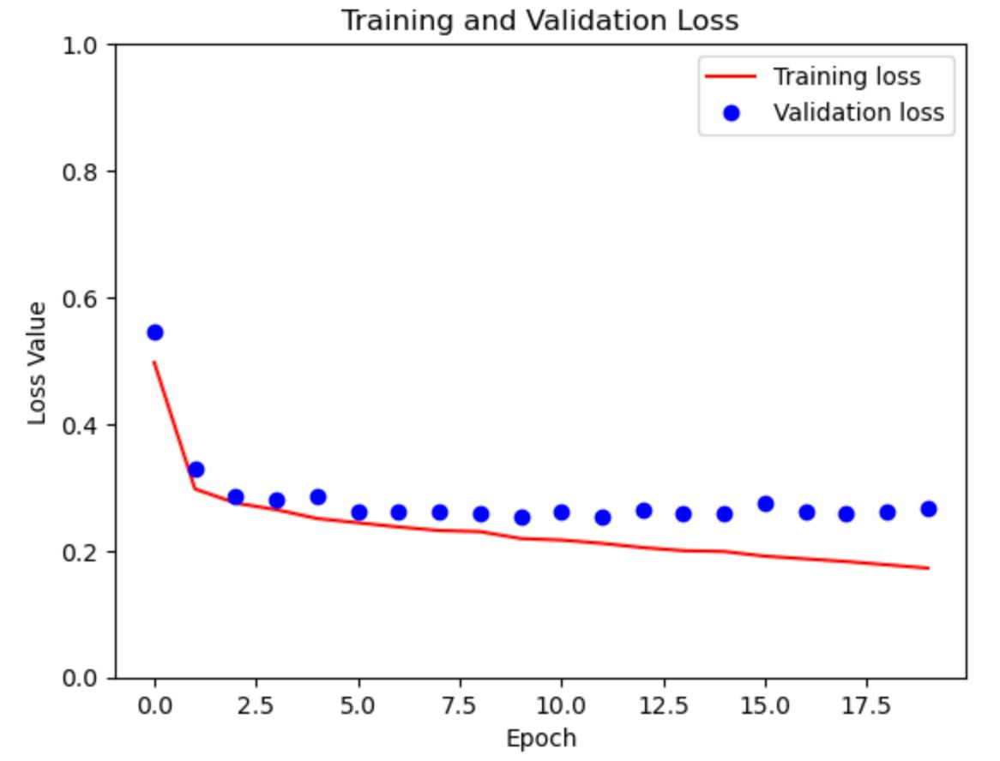
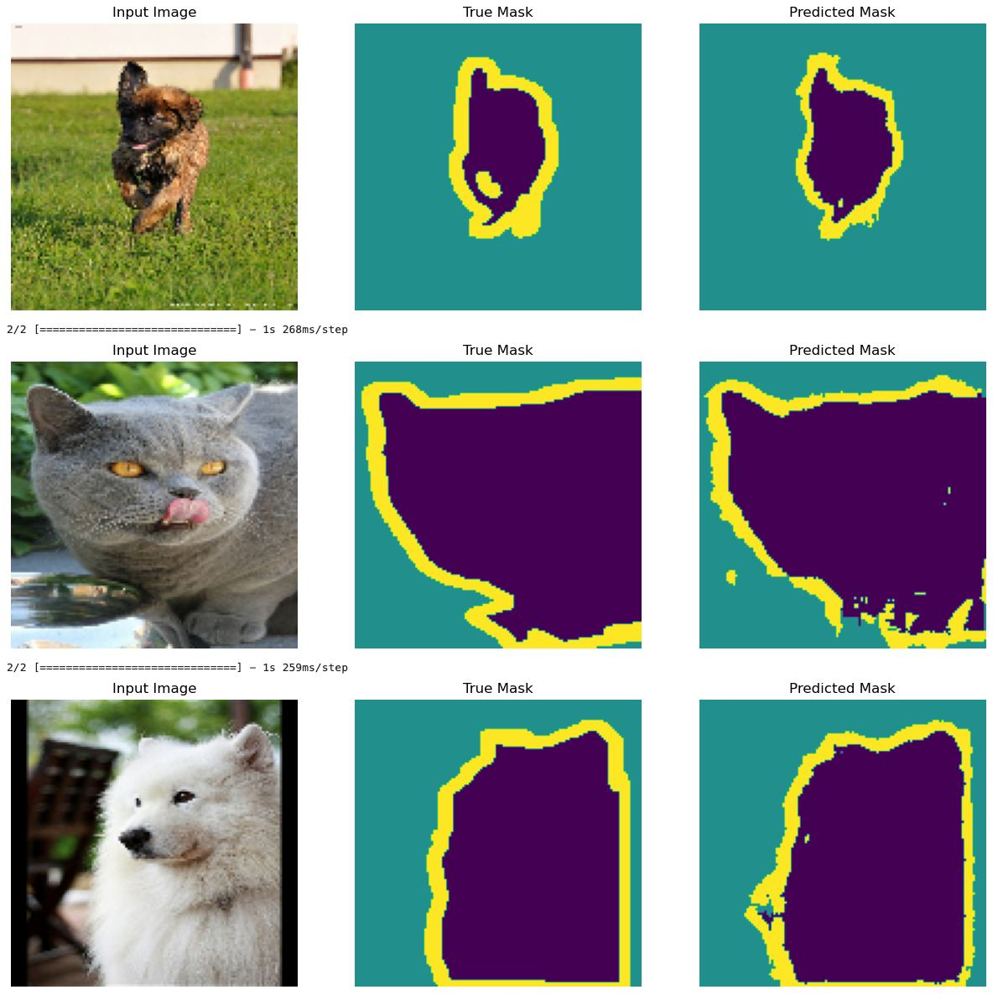

# Image Segmentation

This project focuses on image segmentation using a modified U-Net model on the Oxford-IIIT Pet Dataset.

## Overview

In an image segmentation task, the goal is to assign a class to each pixel in an image. This project uses a U-Net architecture with a MobileNetV2 encoder for segmenting pet images into three classes:
- pixels belonging to the pet,
- pixels bordering the pet,
- surrounding pixels.

## Getting Started
### Prerequisites

- Python 3.x
- TensorFlow
- TensorFlow Datasets

Install dependencies using:

```bash
pip install -r requirements.txt
```

## Dataset
The Oxford-IIIT Pet Dataset is used for training and testing. The dataset is automatically downloaded using TensorFlow Datasets, eliminating the need for manual download and folder management.

```python
# The dataset is loaded directly from TensorFlow Datasets
dataset, info = tfds.load('oxford_iiit_pet:3.*.*', with_info=True)
```

## Project Structure
- **Code Folder:**
    - `dataset.py`: Handles dataset-related tasks, including preprocessing, augmentation, and post-processing.
    - `model.py`: Defines the U-Net model architecture, layers, and loss functions.
    - `train.py`: Contains training code. Accepts dataset paths and hyperparameters as inputs, producing and saving checkpoints.
    - `inference.py`: Contains model inference code for processing a single image, saving the output in the `Result` folder.
- **Result Folder:**
    - Contains the results of the testing phase.

## Usage
Refer to `Code/Segmentation.ipynb` notebook.

## Results
Train and Validation Loss comparison: Validation loss is higher then training loss. The model is not overfitting.
<br><br><br><br>

Got good predictions on unseen data.
<br><br><br><br>

Check the `Result` folder for some segmentation results on test images.

## License
This project is licensed under the MIT License.